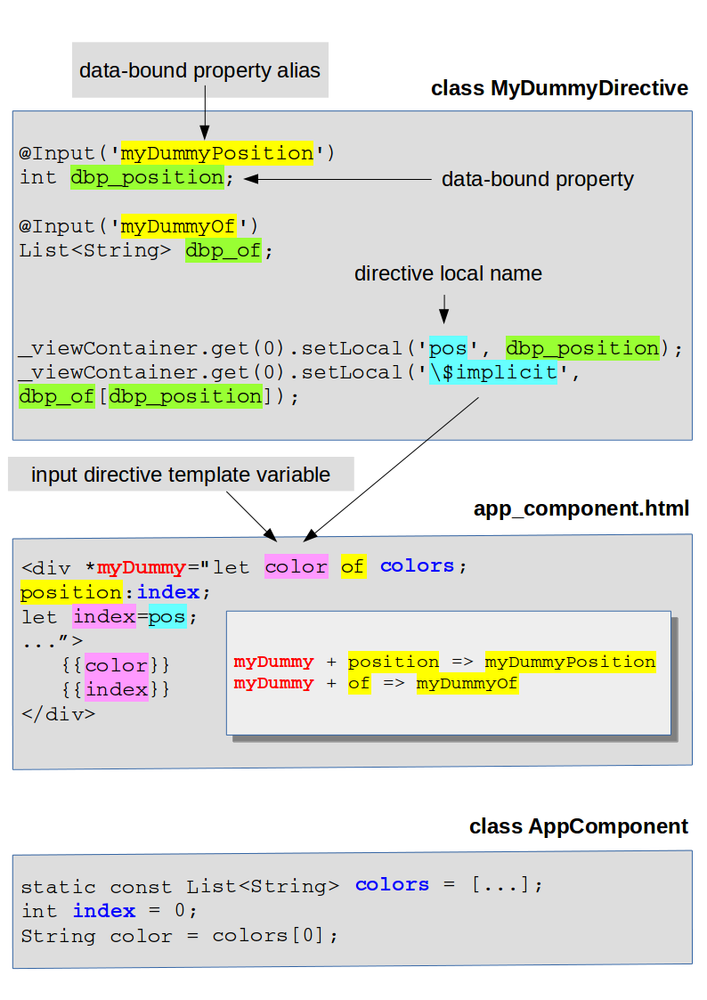

# Description

This application shows how to create a structural directive.

But, first, it seems important to detail some terms that are used within the various documents you can read on the Internet. 

# Data-bound property

A (directive) _data-bound property_ is a directive class property that is annotated by the 
[metadata](https://www.dartlang.org/guides/language/language-tour#metadata) [@Input](https://webdev.dartlang.org/api/angular/angular/Input-class).

Example:

    @Input('myDummyPosition') // This is an alias that makes sense in the template.
    int dbp_position; // This is a data-bound property.
    
    @Input('myDummyOf') // This is an alias that makes sense in the template.
    List<String> dbp_of; // This is a data-bound property.

# Input template variable

## What is an input template variable ?

The [official documentation](https://webdev.dartlang.org/angular/guide/structural-directives) is not pretty clear on that
matter.

First, there are two entities that we call "template":

* The component template.
* The (structural) directive template.

The term "input template variable" makes reference to the (structural) directive template.

> Some may say that it is obvious. I don't agree. When you first read the document, it's not clear.
> Thus I think that it would be better to use the appellation "input directive template variable".

I'll use the appellation "**input directive template variable**" instead of "input template variable".

Now, it's clear. The role of an _input directive template variable_ is to configure a (structural) _directive template_.

Example of input directive template variable:

    

    
Here, we declare an _input directive template variable_ called `input_directive_template_variable`.
And we affect a value to this _input directive template variable_.

> This value cannot be a Dart expression (such as `12`, `['a', 'c']`, `getData()`...).
> The _identifier_ `directive_local_name` represents a _directive local name_ (please see below).

## Where does the value of an input (directive) template variable come from ?

Where does the value of an _input directive template variable_ come from ?

The answer is: the value of an _input directive template variable_ gets assigned within the directive object.
You cannot define the value of an _input directive template variable_ directly within the component template.
For example, the code `
` below will **NOT** assign the value 10 to the _input directive template
variable_ `d`.

The value of the _input directive template variable_ is assigned from within the directive instance.
For example:

    TemplateRef _templateRef;
    ViewContainerRef _viewContainer;
    // ...
    _viewContainer.createEmbeddedView(_templateRef);
    _viewContainer.get(0).setLocal('data', 'MyDummyDirective.data');

And you write, within the component template:

    

> The value of an _input directive template variable_ is carried by a "_directive local name_". See the next section.

# Directive local names

## What is a directive local name ?

This appellation does not come from the official documentation. However, it seems interesting to "coin" it.

Indeed, when you start learning about structural directives the problem is that the same words are used for different
things. The word "template" is a good example: it may make reference to the component template, or to the (structural)
directive template. That IS confusing, since you may adopt the wrong point of view.

So, let's define the appellation "directive local name": a _directive local name_ references a value that can be assigned
to a _directive template input variables_.

> A "directive local name", as its name suggests, is defined within the context of the directive. It only makes sense
> in this context. It is "local" to the (structural) directive.

## Where does the value carried by a "directive local name" come from ?

You create a _directive local name_ like this:

    _viewContainer.get(0).setLocal('directive_local_name', [10, 20]]);

And you assign it to a _directive template input variable_ like this:

    

> "d" is a _directive template input variable_, and its value (within the context of the template) will be `[10, 20]`.

# What is "$implicit"

The name "`$implicit`" is a special _directive local name_ which value is **automatically** assigned to a designated
_directive template input variable_.

This special _directive local name_ makes reference to this syntax:

    
...

The value of the _directive template input variable_ `color` gets assigned to the value carried by the
_directive local name_ `$implicit`.

If:

    @Input('myDummyOf')
    List<String> of;
    ...
    _viewContainer.get(0).setLocal('\$implicit', of);

And:

    *myDummy="let color of colors; ..."

Then:

* the value of the data-bound property `of`, will be the value of the variable `colors`. 
* the value of `color` will be the value carried by the _directive local name_ `$implicit`.
  Thus the value of `color` will be the value of the variable `colors`.

# Summary

# Links

* [Structural directives](https://webdev.dartlang.org/angular/guide/structural-directives).
* [Micro syntax](https://gist.github.com/mhevery/d3530294cff2e4a1b3fe15ff75d08855).
* [Understanding Angular Structural Directives](https://netbasal.com/understanding-angular-structural-directives-659acd0f67e).
  This document refers to AngularJS. But the logic is identical for AngularDart.
* [The Power of Structural Directives in Angular](https://netbasal.com/the-power-of-structural-directives-in-angular-bfe4d8c44fb1).
  This document refers to AngularJS. But the logic is identical for AngularDart.
* [The ngFor directive source code](https://github.com/dart-lang/angular/blob/master/angular/lib/src/common/directives/ng_for.dart).
* StackOverflow: [AngularDart: using template input variables in structural directives](https://stackoverflow.com/questions/53958608/angulardart-using-template-input-variables-in-structural-directives).
